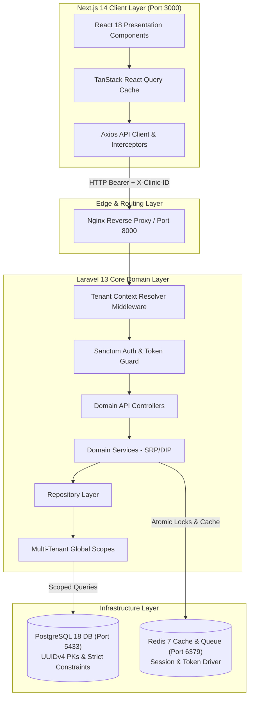
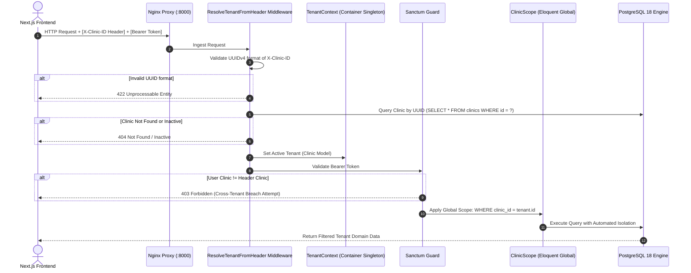
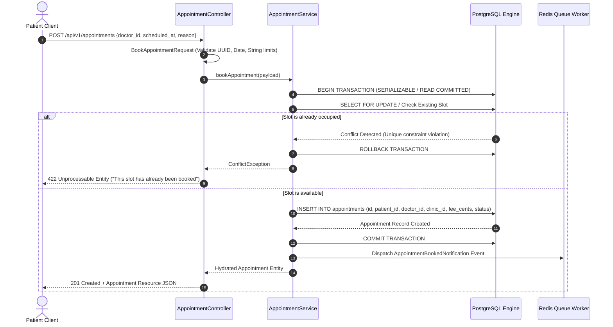
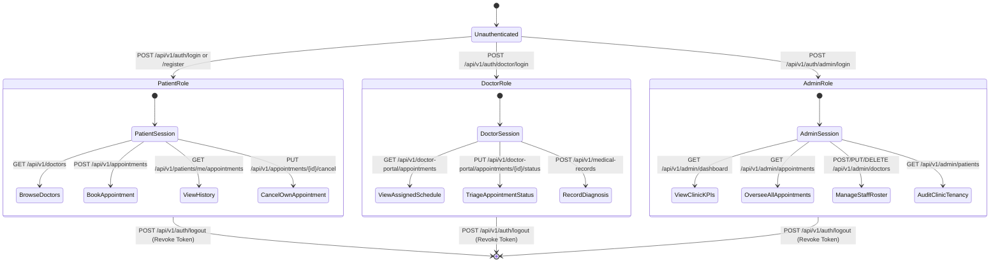
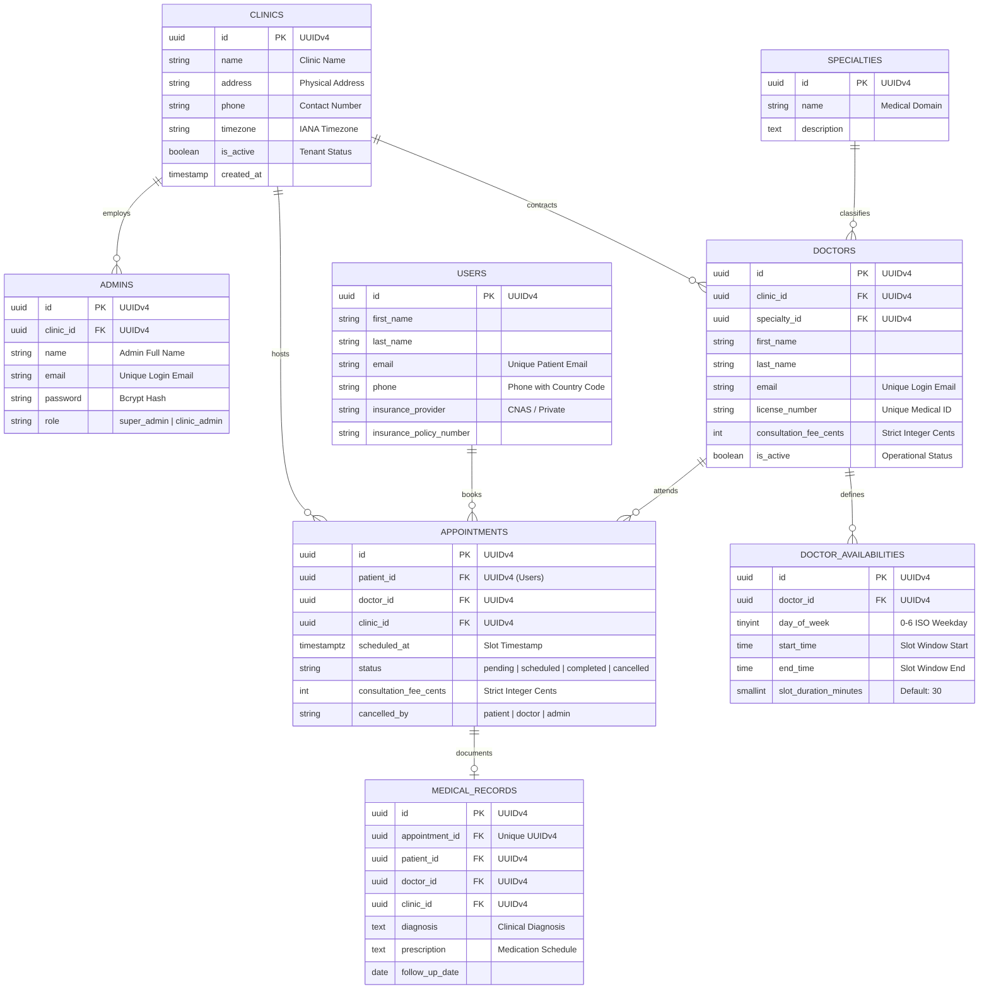

# Project VitalWork / VitalBook: System Architecture & Engineering Concepts

> **Status:** Production Architecture Blueprint
> **Audience:** Principal Architects, Staff Software Engineers, Security & Infrastructure Leads
> **Stack:** Next.js 14 (App Router) · Laravel 13 (REST API) · PostgreSQL 18 · Redis 7 · Docker

---

## 1. Computer Science Foundations & Architectural Philosophy

### 1.1 The "Concept First" Paradigm

Enterprise healthcare systems require extreme data guarantees: zero tolerance for financial rounding drift, deterministic multi-tenant isolation, cryptographic audit trails, and mathematically sound concurrency control.

Building VitalBook upon modern software design principles requires understanding four fundamental computer science pillars:

1. **State Isolation & Memory Footprint:**
   State must never leak across concurrent execution threads. In a multi-tenant medical environment, request context must be strictly scoped to the tenant's execution lifecycle. Global singleton state in long-running processes (e.g., Octane, Swoole, or worker pools) causes cross-tenant data corruption if not bound to ephemeral container instances.
2. **Deterministic Financial Arithmetic (IEEE 754 Avoidance):**
   Standard double-precision floating-point numbers (`IEEE 754`) cannot accurately represent base-10 fractions (e.g., `0.1 + 0.2 !== 0.3`). In healthcare billing, floating-point arithmetic introduces silent penny-shaving errors and reconciliation divergence. Currency is fundamentally a discrete quantity: all balances, prices, and line items must strictly exist as integer cents (`int consultation_fee_cents`).
3. **Distributed Sharding & Entity Identity:**
   Centralized auto-incrementing serial IDs (`BIGSERIAL`) create synchronization bottlenecks, facilitate enumeration attacks, and prevent zero-collision database partitioning. Universally Unique Identifiers (UUIDv4, 128-bit pseudorandom numbers) allow client or service nodes to generate collision-free primary keys asynchronously without cross-node locks.
4. **Concurrency & Linearizability:**
   Doctor appointment calendars represent finite shared resources. Concurrent attempts to reserve the identical time slice constitute a race condition. VitalBook enforces concurrency control at both the application tier (Redis distributed locks) and the database engine tier (PostgreSQL transactional row-level isolation and compound unique index constraints).

---

## 2. Comparative Framework

The following matrix contrasts common junior engineering anti-patterns against the senior architectural implementations enforced within Project VitalWork / VitalBook:

| Dimension                        | Junior / Fragile Approach                                                              | Senior / Elite Engineering Architecture                                                                                                 | Architectural Rationale                                                                                                      |
| :------------------------------- | :------------------------------------------------------------------------------------- | :-------------------------------------------------------------------------------------------------------------------------------------- | :--------------------------------------------------------------------------------------------------------------------------- |
| **Multi-Tenancy**                | Manual`where('clinic_id', $id)` appended in individual controller queries.             | Automated Eloquent Global Scopes registered in tenant-aware abstract models, resolved via immutable middleware context.                 | Eliminates human oversight; a missed`where` clause in junior code leaks private medical records to neighboring clinics.      |
| **Financial Representation**     | Storing fees as`DECIMAL(10,2)` or `FLOAT` in models, with manual formatting in UI.     | Strict integer centimes (`int consultation_fee_cents`), normalized via value objects and formatted solely at the presentation boundary. | Eliminates IEEE 754 precision drift, rounding discrepancies across processors, and currency mismatch bugs.                   |
| **Entity Identity**              | Auto-incrementing sequential integers (`id: 1, 2, 3...`).                              | Universally Unique Identifiers (UUIDv4:`85bc27d0-30e9-4743-88f9-1c799602c3b7`).                                                         | Prevents competitive enumeration scraping; enables database sharding, offline synchronization, and multi-region replication. |
| **Layer Coupling**               | Controllers call ORM directly:`Appointment::create($request->all())`.                  | Decoupled Service-Repository pattern with Data Transfer Objects (DTOs) and Form Request validation.                                     | Adheres to Single Responsibility (SRP) and Dependency Inversion (DIP). Insulates business domains from persistence drivers.  |
| **Concurrency & Double-Booking** | "Check-then-act" (`if (!Appointment::where(...)->exists()) Appointment::create(...)`). | Database compound unique constraint`(doctor_id, scheduled_at)` wrapped in an atomic database transaction.                               | Eliminates Time-of-Check to Time-of-Use (TOCTOU) race conditions during high-volume appointment traffic.                     |
| **Client-Server State**          | Shared state or direct database calls inside Next.js Server Components.                | Decoupled HTTP API with Sanctum Bearer tokens and strict OpenAPI contracts.                                                             | Preserves clear physical and network boundaries between presentation and business logic.                                     |

---

## 3. High-Level System Architecture & Topography

The system uses a completely decoupled Monorepo topography. The presentation layer (Next.js 14) and business persistence layer (Laravel 13 API) communicate over JSON REST interfaces authenticated via Laravel Sanctum.



---

## 4. Multi-Tenant Context Resolution & Global Scope Enforcement

Each request entering the API passes through tenant boundary validation. The clinic context is resolved, verified for active status, and bound to a scoped execution singleton:



---

## 5. End-to-End Appointment Booking & Anti-Double-Booking Guardrail

To prevent overbooking, the system combines database transactions with a unique compound database index: `idx_unique_doctor_scheduled_slot (doctor_id, scheduled_at)`.



---

## 6. Role-Based Access Control (RBAC) & Actor Lifecycle

The VitalBook ecosystem supports three distinct primary actors with explicit boundaries:



---

## 7. Database Entity-Relationship Architecture (UUIDv4 & Integer Cents)

All foreign keys use UUIDv4 identifiers. Financial transactions explicitly store integer cents.



---

## 8. Low-Code Architectural Pseudo-Logic & State Machines

In compliance with the Low-Code Pattern, core invariants are specified via structural state machines and architectural pseudo-logic.

### 8.1 Multi-Tenant Middleware Execution Flow

```text
FUNCTION ResolveTenantFromHeader(Request req, Next next):
    headerClinicId := req.GetHeader("X-Clinic-ID")
    authenticatedUser := req.GetUser()

    IF authenticatedUser != NULL AND authenticatedUser.HasAttribute("clinic_id"):
        IF headerClinicId != NULL AND headerClinicId != authenticatedUser.clinic_id:
            ABORT WITH 403 Forbidden ("Cross-tenant boundary breach detected.")
        headerClinicId = authenticatedUser.clinic_id

    IF headerClinicId != NULL:
        IF NOT IsValidUUIDv4(headerClinicId):
            ABORT WITH 422 Unprocessable ("Invalid tenant UUID format.")

        clinicRecord := QueryDatabase("SELECT * FROM clinics WHERE id = ? AND is_active = true", headerClinicId)
        IF clinicRecord == NULL:
            ABORT WITH 404 Not Found ("Clinic tenant not found or deactivated.")

        TenantContext.BindActiveTenant(clinicRecord)

    RETURN next(req)
```

### 8.2 Appointment Booking Concurrency State Machine

```text
FUNCTION BookAppointment(PatientId, DoctorId, ScheduledSlot, Reason):
    ASSERT ScheduledSlot > CurrentTimestamp() + MinimumLeadTime
    ASSERT DoctorIsActive(DoctorId)

    BEGIN SERIALIZED DATABASE TRANSACTION:
        // Pessimistic or Constraint Lock
        existingSlot := QueryDatabase(
            "SELECT id FROM appointments WHERE doctor_id = ? AND scheduled_at = ? AND status != 'cancelled'",
            DoctorId, ScheduledSlot
        )

        IF existingSlot != NULL:
            ROLLBACK TRANSACTION
            RAISE ConcurrencyConflictException("Slot collision: Double booking prevented.")

        doctorFee := QueryDatabase("SELECT consultation_fee_cents FROM doctors WHERE id = ?", DoctorId)

        appointmentRecord := InsertDatabase("appointments", {
            id: GenerateUUIDv4(),
            patient_id: PatientId,
            doctor_id: DoctorId,
            clinic_id: TenantContext.GetActiveTenantId(),
            scheduled_at: ScheduledSlot,
            status: "pending",
            consultation_fee_cents: doctorFee.consultation_fee_cents,
            reason: Sanitize(Reason)
        })

    COMMIT TRANSACTION

    EmitEvent("AppointmentCreated", appointmentRecord)
    RETURN appointmentRecord
```

---

## 9. Socratic Guard & System Robustness Checkpoints

Before moving to continuous multi-region deployment, the engineering team must resolve the following architectural boundaries:

1. **Data Isolation Under Worker Concurrency:**
   _Question:_ When background workers (`supervisord` / `queue:work`) process queued appointment reminders across multiple clinics, does the worker leak tenant context between jobs?_Mitigation:_ Queue jobs must explicitly serialize the `clinic_id` onto the job payload, and the worker must re-hydrate and flush `TenantContext` upon every individual job invocation (`TenantContext::flush()`).
2. **Network Partitioning & Distributed Locks:**
   _Question:_ If the Redis cluster encounters a failover split-brain scenario during appointment booking, can two patients book the same slot simultaneously?_Mitigation:_ The primary source of truth remains the PostgreSQL composite unique constraint `(doctor_id, scheduled_at)`. Redis acts as an optimistic rate limiter; PostgreSQL acts as the ACID invariant boundary.
3. **Client-Side Auth Token Invalidation:**
   _Question:_ If an admin revokes a doctor's credential in the backend, what guarantees exist that the Next.js client does not continue rendering cached patient records?
   _Mitigation:_ Next.js uses TanStack React Query with strict cache TTLs and an Axios response interceptor that purges `localStorage` and redirects to `/signin` upon receiving any `401 Unauthorized` response.
