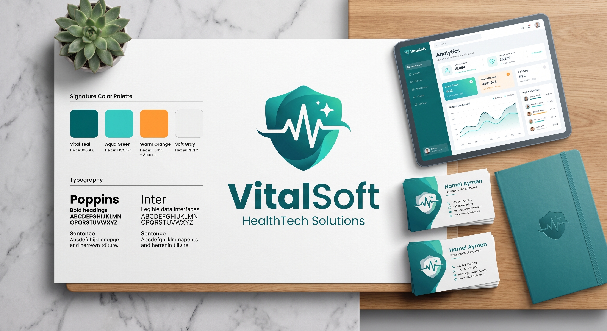

# VitalSoft — Brand Identity & Guidelines

> **Status:** Finalized Brand Identity  
> **Brand Name:** Vital Soft (VitalSoft)  
> **Tagline:** HealthTech Solutions  
> **Founder & Chief Architect:** Hamel Aymen  
> **Domain:** [https://vitalsoft.com](https://vitalsoft.com) | `contact@vitalsoft.com`

---

## 1. Executive Summary

**Vital Soft** is the parent technology brand specialized in enterprise-grade software engineering, primarily focused on:
- **Booking & Scheduling Systems:** Intelligent patient-doctor appointments, multi-channel notifications, and workflow triage.
- **Recruitment & Talent:** Healthcare professional onboarding, credentialing, and staffing management.
- **Edu Health:** Medical educational portals, clinical continuous learning, and patient health literacy.
- **Healthcare Digital Transformation:** Secure, HIPAA/GDPR-compliant cloud architectures, with Algerian locale integration (CNAS/Chifa).

Flagship products include **Pulse Pro / CarePulse V1**.

---

## 2. Brand Visual Identity

### 🎨 Signature Color Palette

| Color Name | Hex Code | Role & Usage |
|---|---|---|
| **Vital Teal** | `#006666` | **Primary Brand Color**: Headers, shield base, primary buttons, dominant accents |
| **Aqua Green** | `#33CCCC` | **Secondary Vibrant**: Gradients, active highlights, badges, glowing borders |
| **Warm Orange** | `#FF9833` / `#FF0833` | **Accent Color**: Notification badges, alerts, urgency tags, CTA highlights |
| **Soft Gray** | `#F2F2F2` | **Neutral Background**: Card surfaces, light theme canvas, subtle dividers |

### 🔤 Typography

- **Headings & Display:** `Poppins` (Bold, SemiBold) — modern, friendly, authoritative
- **Data Interfaces & Body:** `Inter` — ultra-legible, crisp numerical alignment, dashboard-optimized

### 🛡️ Logo & Iconography

- **Emblem:** Curved shield symbolizing data protection, clinical security, and trust.
- **Pulse/ECG Line:** White dynamic cardiac rhythm crossing the shield, representing vitality, real-time monitoring, and health tech.
- **Sparkle Stars:** Two quad-point stars at the upper-right corner denoting premium quality and innovation.
- **Vector Assets:** Available at `frontend/public/assets/icons/vitalsoft-logo.svg` and `docs/brand/vitalsoft-logo.svg`.

---

## 3. Leadership & Contact Information

- **Founder & Chief Architect:** Hamel Aymen
- **Headquarters / Operations:** Algiers, Algeria / Global
- **Official Website:** [https://vitalsoft.com](https://vitalsoft.com)
- **General Inquiries:** `contact@vitalsoft.com`
- **Architecture / Engineering:** `aymen@vitalsoft.com`

---

## 4. Architectural Integration Guidelines

1. **Footer & Product Attributions:**
   - Any software developed under this brand must credit:  
     `Engineered by Vital Soft · All rights reserved.`
2. **Repository Naming:**
   - Git remotes and package namespaces reference `vitalsoft` (e.g., `github.com/vitalsoft/...`).
3. **Strict Policy:**
   - Deprecate all legacy occurrences of `HML Soft` / `Vital Solutions` in favor of **Vital Soft**.
